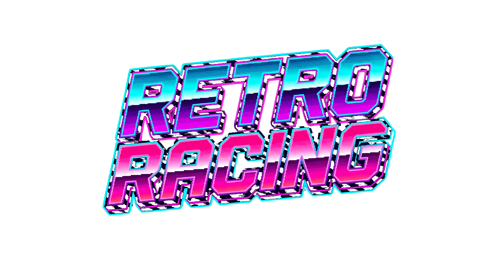

# 🏎️ Retro Racing

  

An endless, high-speed arcade racing game built from scratch in Godot 4 using a **custom pseudo-3D rendering engine** (inspired by classics like *OutRun* and *Lotus*). Dodge traffic, collect powerful rogue-lite upgrades, and compete for the top spot on the global leaderboard!

---

## ✨ Features

- 🏁 **Custom Pseudo-3D Engine**: Experience seamless track curving, day/night cycles, dynamic fog, and distant city skylines—all rendered without native 3D physics.
- 🃏 **Rogue-lite Progression**: Every 1,000 points, the game freezes and offers you a choice of 3 random upgrades out of a pool of 10 unique abilities (Top Speed, Handling, Ghost Shields, Calm Traffic, and more). Upgrades scale exponentially!
- 🌐 **Global Leaderboard**: Fully integrated online scoreboard. Compete against the world to see who can survive the longest at supersonic speeds.
- 🚗 **Advanced Traffic AI**: The highway is filled with cars, buses, and trucks that actively calculate speeds, use turn signals, and dynamically switch lanes to block your path.
- 🎵 **Dynamic Audio**: DJ-style crossfading between synthwave tracks, procedural engine pitch scaling, and immersive high-speed wind/skid sound effects.

---

## 🎮 Controls

The game fully supports Keyboard and Mouse navigation.

| Action | Keybinding |
| :--- | :--- |
| **Accelerate** | W / Up Arrow |
| **Brake** | S / Down Arrow |
| **Steer Left/Right** | A / D or Left / Right Arrows |
| **Select Upgrade / UI** | Mouse Click / Space / Enter |
| **Pause / Back** | Esc |

---

## 🛠️ How to Play

1. **Start Engine**: Enter your codename to register on the global leaderboard.
2. **Drive**: The faster you go, the faster you earn points. Be careful not to drive off-road, or your speed will plummet.
3. **Level Up**: Upon reaching 1,000 points, you will level up. Choose your upgrades wisely to build the ultimate high-speed machine.
4. **Survive**: Hitting a car at over 20,000 KM/H is instantly fatal unless you have a Ghost Shield.
5. **Brag**: Check the HALL OF FAME in the main menu to see if you made the Top 10!

---

## 🚀 Installation & Exporting (For Developers)

To run this project from source:
1. Clone this repository.
2. Open the project folder using **Godot 4.2.2+**.
3. Press F5 to run the game!

**Important Export Note**: When exporting the game to a .exe, ensure you add *.png, *.mp3, *.wav, *.ttf to the **"Filters to export non-resource files/folders"** field in your Export Preset. This guarantees all dynamically loaded assets are correctly packaged.

---

## 👨‍💻 Credits

Developed and designed by **Dmitry Smirnov** ([@ainsonet](https://github.com/ainsonet)).
